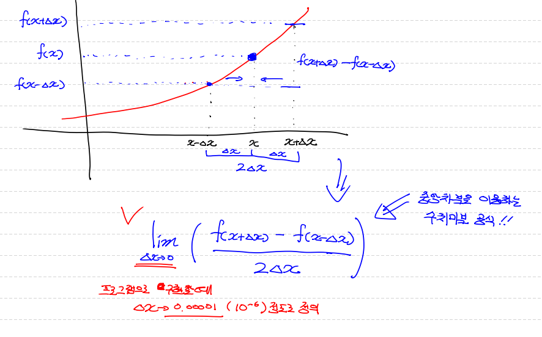

# 머신러닝02 - 미분

> 미분에 대해 알아보자


## 미분의 정의(미분함수 Derivative)

> 어떤 함수의 정의역 속 각 점에서 독립변수의 변화량과 함수값의 변화량 비율의 극한으로 구성된 집합으로 치역이 구성되는 함수.


## 미분법(Differentiation)

> 미분을 하는 작업, 도함수를 구하는 작업 그 자체.


## 미분의 종류


* 수치미분

  * 프로그램적으로 계산을 통해서 미분을 수행. 
  * 약간의 오류가 발생함.

  

* 해석미분

  * 미분이론에 입각해서 펜과 종이를 이용해서 미분을 수행.


**결국 미분은 함수에 대해 특정순간의 변화량을 나타냄.**

 **x의 변화가 f(x)를 얼마나 변화시키는지**

**변화량이  0의 극한으로 가기 때문에 결국엔 f(x)에 대한 기울기를 구하는 것**


## 수치미분 (Numerical Differentiation)

* 전향 차분
* 중앙 차분 (그림)
* 후향 차분





```
차분은 범위를 나타냄.

중앙차분이 일반적으로 정확도가 가장 높기 때문에 이 개념을 이용.

프로그램 구현할 때 극한은 0.00001 (10의 -6승)정도로 정의.
```


## 기본 미분 공식

```
f(x) = constant(상수)

1. 
f(x) = 3
f`(x) = 0

2. 
f(x) = ax^n
f`(x) = nax^n-1

3. 
f(x) = e^x
f`(x) = e^x

4.
f(x) = e^-x
f`(x) = -e^-x

5.
f(x) = log(x)
f`(x)  = 1/x

ex)
f(x) = 3x^2 + e^x + 1/x
f`(x) = 6x + e^x - 1/x^2
```


## 편미분(Partial Derivative)

> 입력변수(독립변수)가 2개 이상인 다변수함수에서 미분하고자 하는 변수를 제외한 나머지 변수들을 상수처리해서 미분 진행


```
편미분


* f(x.y) = 2x + 3xy + y^3

* f(x.y)를 x에 대해서 편미분하는 경우
	df(x.y)/dx = 2 + 3y


* f(x.y)를 y에 대해서 편미분하는 경우
	df(x.y)/dy = 3x + 3y^2
```


## 연쇄법칙(Chain Rule)

> 합성함수를 구성하는 각 함수를 각각 미분해서 그 결과의 곱으로 계산


* 합성함수(Composite Function) : 여러 함수로 구성된 함수

  

```
f(x) = e^3x^2

-> function e^t, function t = 3x^2

df/dx = df/dt * dt/dx 을 적용하면
-> f`(x) = d(e^t)/dt * d(3x^2)/dx = e^t * 6x = 6x * e^3x^2
```


## Numerical Differentiation의 구현

> Jupyter notebook 으로 수치미분을 코드로 구현해보기.


* 단변수 함수 구현

```python
f`(x) = lim(f(x+dx)-f(x)/dx) -> lim(f(x+dx)-f(x-dx)/2dx)

일변수 함수에 대한 수치미분 코드를 구현

# 입력으로 들어오는 x에서 아주 미세하게 변화할 때
# 함수 f가 얼마나 변하는지에 대해 수치적으로 계산해보기

# 아래의 함수는 인자를 2개 받아요.
# 한개는 미분하려는 함수, 특정 점에서 미분값을 구하기 위한 x값.
def numerical_derivative(f,x):
    
    # f: 미분하려는 함수
    # x : 미분값을 알고자하는 입력값.
    # delta_x : 극한에 해당하는 값으로 아주 작은값을 이용. 1e-8 이하로 지정하면 소수점 연산 오류가 발생
    # 일반적으로 1e-5정도로 설정
    delta_x = 1e-5
    return ( f(x+delta_x) - f(x-delta_x) ) / (2 * delta_x)

# 미분하려는 함수가 있어야 함. (단변수 함수)
def my_func(x):
    
    return x ** 2  # f(x) = x^2

# 주의
# result = numerical_derivative(my_func(2),)하면 my_func가 실행되어 미리 계산됨.
# 하나의 함수한테 다른 함수 자체를 인자로 넘길 수 있는 일급함수 개념을 사용.
result = numerical_derivative(my_func,3)
print('미분한 결과값은 : {}'.format(result)) # 미분한 결과값은 : 6.000000000039306
```


* 다변수 함수 구현

```python
# 일반적으로 다변수 함수의 수치미분 코드를 이용함.

# 입력변수가 2개 이상인 다변수 함수인 경우
# 입력변수는 서로 독립이기 때문에 수치미분 역시 변수의 개수만큼 개별적으로 진행.
# 각 변수에 대한 편미분을 수행

# numpy를 사용하는 이유는 다변수함수를  행렬로 표현해주기 위해서
import numpy as np

def numerical_derivative(f,x):
    # f : 미분하려고 하는 다변수 함수
    # x : 모든 값을 포함하는 numpy array ex) f`(1.0, 2.0) = (8.0, 15.0)
    delta_x = 1e-4
    derivative_x = np.zeros_like(x)   # [0.0]  # 결과 저장용
    # np.zeros_like : ~처럼 만들어서 0으로 채우세요
    
    it = np.nditer(x, flags=['multi_index'])  # np array 반복할 때 사용 
    # flags를 사용하는 이유는 3개 이상으로 변수가 주어질 때 매트릭스로 들어 올 수 있기 때문
    
    while not it.finished:
        
        idx = it.multi_index  # 현재의 iterator의 index를 추출 => tuple형태로
        print('현재의 idx 값은 : {}'.format(idx))
        
        tmp = x[idx]  # 현재 index의 값을 잠시 보존. 
                      # delta_x를 이용한 값으로 ndarray를 수정한 후 편미분을 계산
                      # 함수값을 계산한 후 원상복구를 해 줘야 다음 독립변수에 대한
                      # 편미분을 정상적으로 수행할 수 있음.
        print('현재 temp : {}'.format(tmp))
        
        x[idx] = tmp + delta_x
        fx_plus_delta = f(x)   # f([1.00001, 2.0]) => f(x + delta_x)
        
        x[idx] = tmp - delta_x
        fx_minus_delta = f(x)   # f([0.99999, 2.0]) => f(x - delta_x)
        
        derivative_x[idx] = (fx_plus_delta - fx_minus_delta) / (2 * delta_x)
        
        x[idx] = tmp # 다음 독립변수 편미분을 위해 원상복귀
        
        it.iternext()
        
    return derivative_x

# # 미분하려는 함수가 있어야 함. (단변수 함수)
# def my_func(x):
    
#     return x ** 2  # f(x) = x^2

# result = numerical_derivative(my_func,np.array([3.0])   # 현재의 idx 값은 : (0,) 
#                                                               # 현재의 idx 값은 : (1,)

    
# 미분하려는 함수가 있어야 함. (다변수 함수)
def my_func(input_data):
    
    x = input_data[0]
    y = input_data[1]
    
    return 2*x + 3*x*y + np.power(y,3)  # f(x) = 2x + 3xy + y^3

param = np.array([1.0,2.0])
result = numerical_derivative(my_func, param)
print('미분한 결과는 : {}'.format(result))
```


```python
현재의 idx 값은 : (0,)
현재 temp : 1.0
현재의 idx 값은 : (1,)
현재 temp : 2.0
미분한 결과는 : [ 8.         15.00000001]
```


## Regression(회귀)


### Regression Model(회귀모델)

> 특정 데이터에 대해서 
>
> 그 값에 영향을 주는 조건을 고려하여
>
> 데이터의 평균을 구하기 위한 함수


* 어떤 연속형 데이터 `Y`와 `Y`의 원인으로 생각되는 `X`간의 관계를 추정하기 위해서 만든 `Y = f(x) + e` 관계식
* 관계식 `Y = f(x) + e` 은 `Y = h(x1,x2,x3.... ;b1,b2,b3...bk) + e`로 표현할 수 있음.


* 모델을 만드는 이유?
  * 우리가 해결해야 하는 현실은 너무 복잡하여 단순화하기 위함.


* Regression Model 이란?

```
평균이라는 표현은 어떤의미로 사용하나???

# 대표성을 나타냄
```


즉 회귀모델은 특정 데이터를 가장 잘 표현하는 함수를 구하는 것임.


```
독립변수가 1개인 함수를 가정하면

y = b0 + b1x


b0 = 기타 영향을 주는요인

b1 = x에 영향을 주는 요인


즉 y = ax +b 로 표현할 수 있음.
```


**결론**

* 우리가 구하려는 Regression Model은 주어진 데이터를 가장 잘 표현하는 직선을 찾는 것이라고 할 수 있음. (독립변수가 1개인 경우)

* 이를 *"Classical linear Regression Model(고전적 선형 회귀모델)"* 이라고 함.


### Classical linear Regression Model(고전적 선형 회귀모델)

* 오차항을 평균이 0, 정규분포
* 독립변수와 종속변수 선형
* 데이터에 아웃라이어가 X
* 독립변수와 오차항은 독립


**일반식**

```
단변량 선형 회귀모델(종속변수가 1개)

독립변수 1개 (단순 선형 회귀모델)
y = b0 + bi*xi

독립변수 2개 이상 (다중 선형 회귀모델)
y = b0 + b1*x1 + b2*x2 +...bp*xp
```


**강사님 Tip**

```
배운 용어들을 잘 정리해서
이후 강의시간에 잘 이해할 수 있도록 준비!
```


