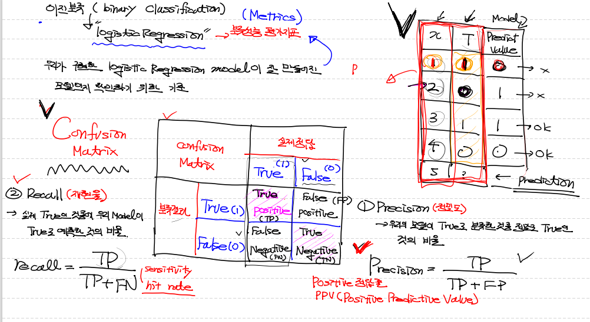

# Metrics

* 지난 시간, 예제를 코드 구현시 한계점으로 성능평가요소 부재가 있음.
* 우리가 구현한 Logistic Regression Model이 잘 만들어진 모델인지 확인하기 위한 기준.
* data를 가지고 Confusion matrix를 만들고, 이를 바탕으로 precision과 recall을 구할 수 있음.

### Confusion Matrix

### Precision(정밀도)

* 우리의 모델이 True로 분류한것 중 정답의 True와 일치하는 비율

* TP / TP + FP 
* postive 정답률, PPV라고도 함.

### Recall(재현율)

* 실제 True인 것 중에 우리모델이 True라고 예측한 것의 비율
* TP / TP + FN 
* sensitivity, hit rate라고도 함.

**Precision(정밀도) 와 Recall(재현율)의 관계는 반비례**

---

### Accuracy(정확도)

* Precsion 보다 범용적이고 직관적인 성능평가 방법.
* TP + TN / TP + FN + FP + TN
* Accuracy를 수업 때 쓰기 때문에 코드표현을 할 줄 알아야함.

* 그럼 굳이 Precsion과 Recall을 쓰는 이유는 Accuracy의 단점 때문.

* 단점은 domain의 bias를 반드시 고려해야함.

