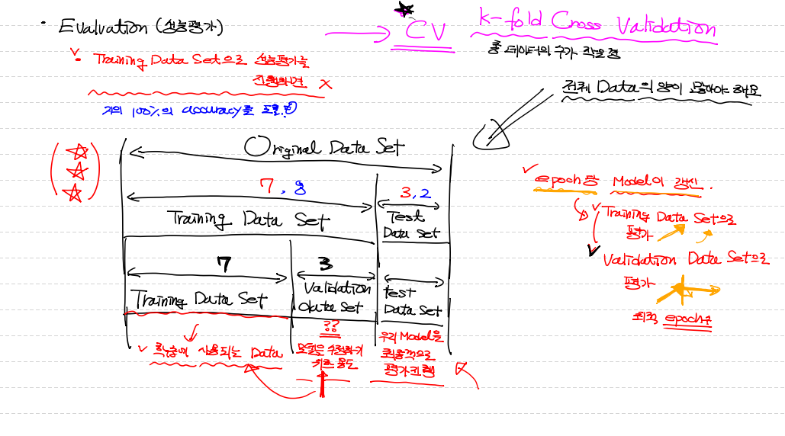

# 다양한 Metric 성능평가지표

## 조화평균

* Precision과 Recall을 둘 중에 하나 선택하기에는 애매한 데이터에는 조화평균이용.
* 조화평균의 값을 이용해서 모델의 성능평가가 가능
* 이를 F1 Score이라고 함.
* 2 * Precsion * Recall / Precsion + Recall

## Fall-out

* FP / TN + FP
* 실제값은 False인데 우리 모델이 True라고 잘 못 예측한 비율.
* Recall과 Fall-out을 그래프로 표현 => ROC curve

# 추가적으로 알아두어야 할 사항

## Learning Rate

* W,b를 갱신할 때 사용되는 customizing 상수
* 만약 Learning Rate를 필요이상으로 크게 설정하면 그래프 밖으로 발산하여 W를 찾을 수 없음 => overshooting 현상.
* 반대로 아주 작게 만들면 W까지 도달 못한 채로 반복이 끝남. (local minima)
* 이상적인 방법이 존재하지 않음.

## Model의 상태를 지칭하는 용어

* Data를 이용해서 학습이 끝난 후 우리 Model의 상태를 지칭하는 용어 2가지.
* overfitting, underfitting이 있음.

### Overfitting (과대적합)

1. **개념**

* 우리 Model이 Training Data Set에 너무 집착해서 딱 들어맞는 형태로 Model로 만들어진 경우.
* 실제 데이터가 들어왔을 때 training data set을 기준으로 잘못 예측되어짐.
* 정확도가 떨어짐.

2. **원인**

* epoch 수에 영향을 받음. 너무 많은 epoch을 가져가면 발생.
* data의 양이 적을 때 발생.

3. **예방**

* data의 양이 적을 때, 증식이나 data양을 늘리는 방법을 사용.
* 중복되고 필요치 않는 독립변수들을 줄이는게 좋음.

### Underfitting (과소적합)

* 충분한 학습이 제대로 이루어지지 않은 경우.
* Model 자체가 비완성.

# Evaluation (성능평가)

* 교차검증방식 ( K-fold Cross Validation / CV)

* 성능평가를 하려면 전체 Data의 양이 많아야 함.

* training data set으로 성능평가를 진행하면 안됨.
* training data set : 학습에 사용되는 data.
* validation data set : training data set을 가지고 학습할 때 평가를 하고 모델을 수정하기 위한 용도.
  * overfitting 직전의 기준점이 최적의 적합점인데, 그것을 validation data를 통해 알아낼 수 있음.
* test data set : 우리 model을 최종적으로 평가 진행하는 용도. 수정x

