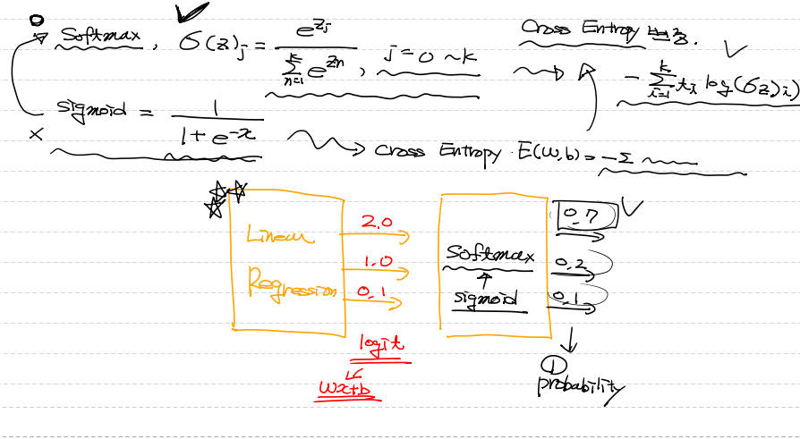
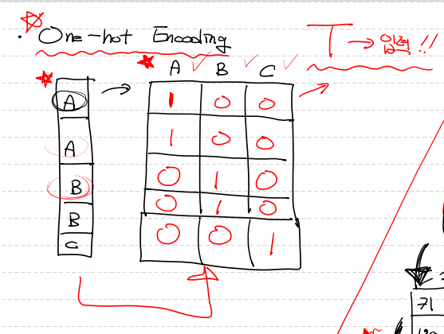

# Multinomial Classificaion

1. 개념
   * 다중분류 : 여러개의 분류 중에 어떤 분류에 속하는지를 예측기법.
   * x 의 입력 feature가 늘어나면 차원이 늘어남. 
   * 평면을 구해야 되고 이를 초평면 (hyperplane)이라 지칭.
   * 결국 이 초평면을 구해야 함.


2. 구현

   * 최종적으로 얻는 것은 독립변수들의 확률 합을 1로 두고 각각의 확률값이 나옴.
   *  tensorflow로 주로 구현, python에서 구현은 어려움.
   * Binary Classification과 차이점.
     * 행렬식
     * activation function
     * loss function
     * 결과 도출 시 확률값.

   * 학습시킬 때 문제점은 t(labels)이 loss 안에 들어가야 하는데 연산이 가능한 형태로 들어가야 함.
     * One-hot encoding으로 문제 해결


## softmax



* 개념
  * 그래프를 나눠서 각각의 변수를 구분하는 logistic regression 구성이 되므로 모델이 달라짐.
  * Activation function을 sigmoid로 쓰지 않고, softmax로 사용.
  * softmax가 convex함수가 아니기 때문에 새로운 loss함수를 적용해야함.
* 코드로 표현

```python
# Hypothesis
logit = tf.matmul(X,W) + b
H = tf.nn.softmax(logit)

# loss
loss = tf.reduce_mean(tf.nn.softmax_cross_entropy_with_logits_v2(logits=logit,
                                                                 labels=T))
```


## One-hot Encoding



* 개념
  * 각 labels을 0과 1로 표현하는 방법.
  * tensorflow 함수로 표현이 가능.
  * depth는 labels의 개수
* 코드로 표현

```python
# tensorflow 기능을 이용하여 one-hot encoding
sess = tf.Session()
norm_t_data = sess.run(tf.one_hot(t_data, depth=3)) # depth는 몇개의 종류의 label이 있는지
print(norm_t_data)
```


# BMI 실습

* Bmi.csv 데이터로 Multinomial Classification 구현.


## Raw Data

* 필요한 모듈 import 하기.
* pandas read로 데이터 불러오는데 주의사항은 데이터의 맨윗줄부터 3줄까지 주석데이터가 있기 때문에 skiprows처리를 해줘야함.

```python
# Multinomial Classification

# Tensorflow로 구현하기
import numpy as np
import pandas as pd
import tensorflow as tf
import matplotlib.pyplot as plt
from scipy import stats
from sklearn.preprocessing import MinMaxScaler

# Raw Data loading # 3줄 제외하고 읽어야 함.
df = pd.read_csv('./data/bmi.csv', skiprows=3)
display(df.head(), df.shape)  # (20000, 3)
```


## 결측치 처리

* 결측치가 존재하는지 확인하기
* 확인 결과 없으므로 다음 단계 진행.

```python
# 결측치 처리
df.isnull().sum()  # 결측치 없음
```


## 이상치 처리

* matplotlib.pyplot의 boxplot으로 이상치 있는지 확인하기.
* 이상치 없으므로 다음 단계 진행.

```python
# 이상치 처리     # 이상치 없음
fig = plt.figure()
fig_1 = fig.add_subplot(1,3,1)
fig_2 = fig.add_subplot(1,3,2)
fig_3 = fig.add_subplot(1,3,3)

fig_1.boxplot(df['label'])
fig_2.boxplot(df['height'])
fig_3.boxplot(df['weight'])

fig.tight_layout()
plt.show()
```


## Training Data Set

* 정규화 전에 training data set 준비
* Series로 오기 때문에 values를 붙여서 numpy array로 변경.

```python
# Training Data set
x_data = df[['height', 'weight']].values
t_data = df['label'].values  # one hot encoding으로 변환 해줘야함 
                             # 1차원 백터에서 2차원 매트릭스로 변경하여 one got encoding
```


## 데이터 정규화

* x 데이터의 height와 weight를 확인해보면 편차가 심한 것을 알 수 있음.
* t 데이터는 0,1,2로 구성되어 편차가 심하지 않음. one-hat처리 필요.
* x 데이터만 정규화가 필요.
* sklearn.preprocessing의 MinMaxScaler 이용하여 정규화 진행.

```python
scaler_x = MinMaxScaler()
scaler_x.fit(x_data)
norm_x_data = scaler_x.transform(x_data)
print(norm_x_data)  # 2차원 numpy의 정규화된 데이터를 확인 할 수 있음.
```


## One-hot encoding

* tensorflow 기능을 이용하여 진행.

```python
# tensorflow 기능을 이용하여 one-hot encoding
sess = tf.Session()
norm_t_data = sess.run(tf.one_hot(t_data, depth=3)) # depth는 몇개의 종류의 label이 있는지
print(norm_t_data)
```


## Tensorflow 구현

* Shape에 주의 변수와 col의 개수를 잘 파악.
* Hypothesis에서 softmax 사용.

```python
# placeholder
X = tf.placeholder(shape=[None,2], dtype=tf.float32) # hight, weight col 2개이기 때문에
T = tf.placeholder(shape=[None,3], dtype=tf.float32) # ont-hot encoding 으로 label의 개수가 3개이 때문에

# Weight & bias
W = tf.Variable(tf.random.normal([2,3]), name='weight')
b = tf.Variable(tf.random.normal([3]), name='bias') # logistic 이 3개이기 때문에

# Hypothesis
logit = tf.matmul(X,W) + b
H = tf.nn.softmax(logit)

# loss
loss = tf.reduce_mean(tf.nn.softmax_cross_entropy_with_logits_v2(logits=logit,
                                                                 labels=T))

# train
train = tf.train.GradientDescentOptimizer(learning_rate=1e-4).minimize(loss)

# 초기화 ( 위에서 세션 처리 해줌)
sess.run(tf.global_variables_initializer())

# 학습진행
for step in range(30000):
    _, W_val, b_val, loss_val = sess.run([train,W,b,loss], 
                                         feed_dict={X:norm_x_data,
                                                    T:norm_t_data})
    if step % 3000 == 0:
        print('W : {}, b: {}, loss: {}'.format(W_val, b_val, loss_val))
```


## Predict

* 결과값이 잘 맞지 않는 것 같음.
* 문제점은 다음 강의에 찾고 수정해보기.

```python
# 잘 만들어진 모델인지 확인하기(train, validation)

# predict
height = 187
weight = 78
my_state = [[height, weight]]
result = sess.run(H, feed_dict={X:scaler_x.transform(my_state)})
print(result)
```

