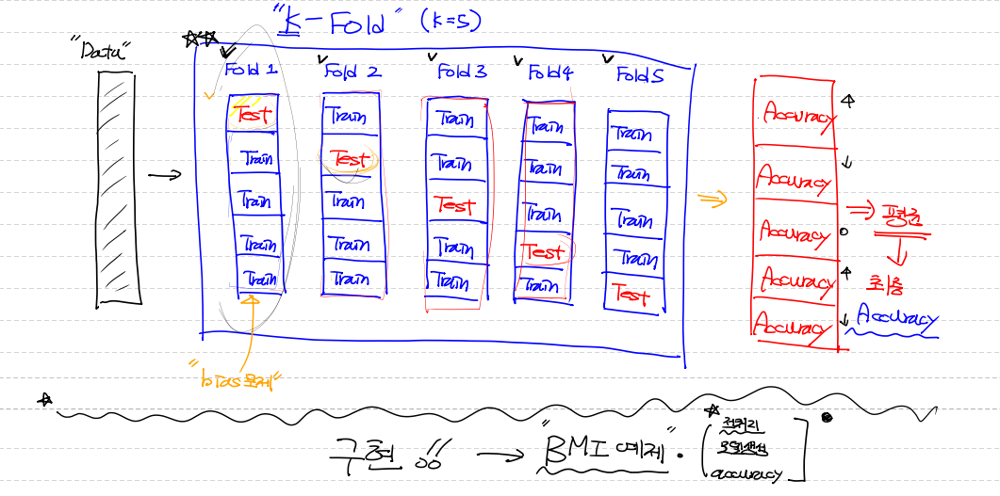

# K-Fold

* K값이 5인 경우 데이터를 5개의 폴드로 나눔.
* 또한 1개의 폴드를 5개로 나눔.
* 각 폴드마다 나누어진 5개의 데이터를 번갈아가면서 Test용 data를 사용
* 각 test data의 Accuracy 5개를 모아서 평균을 낸 것이 최종 Accuracy



```python
# K-Fold Cross Validation

# 5개의 폴드를 나누니까 5번을 학습해야함.
# 몇개의 폴드를 할 것인지 결정하는 변수 지정해주기.
cv = 5  # Fold의 수
results = [] # 각 Fold당 학습과 성능평가가 진행되는데 이때 계산된 성능평가 값을 저장

# Fold를 나누자
# 훈련set과 검증set으로 나누기
kf = KFold(n_splits=cv, shuffle=True)

for training_idx, validation_idx in kf.split(x_data_train_norm):
    # split 하면 각각의 index값이 튀어나옴.
    training_x = x_data_train_norm[training_idx] # Fancy indexing
    training_t = t_data_train_onehot[training_idx]
    
    val_x = x_data_train_norm[validation_idx]
    val_t = t_data_train_onehot[validation_idx]
    
    # 학습부터 시켜야 함.
    run_train(sess,training_x,training_t)
    results.append(sess.run(accuracy, feed_dict={X:val_x, T:val_t}))
    
print('측정한 각각의 결과값 : {}'.format(results))
print('최종 K-Fold 교차검증을 사용한 Accuracy : {}'.format(np.mean(results)))
```