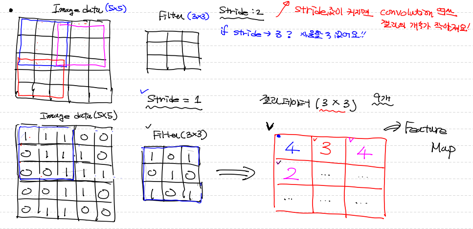
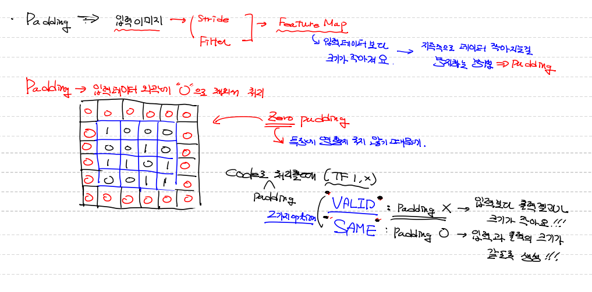
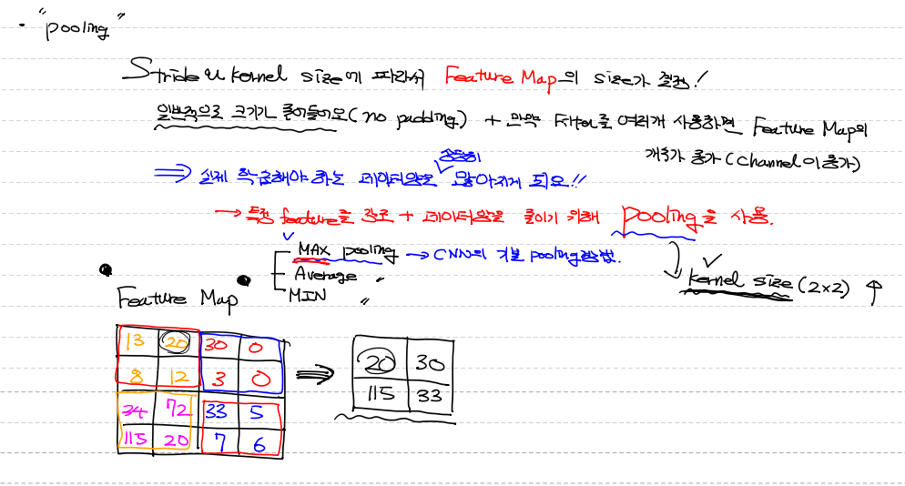

# CNN-Convolution

Convolution 과정에서 나오는 여러 개념과 메커니즘을 이해하기.


## 합성곱

**개념**

두 함수 f,g가 존재할 때 하나의 함수로 반전(everse),  전이(shift) 시킨 후 다른 함수와 곱해주고 결과를 적분.


**적용**

Image data와 Filter의 같은 픽셀 위치에 있는 요소끼리 곱한 후 그 결과값들의 합.


## Channel

**개념**

정확히는 컬러값이 아니라 현재 차원에 몇 개 channel이 있는지 명시.


**예시**

이미지 pixel의 값은 실수값으로 표현하며, color인 경우 각 pixel은 RGB 3개의 실수로 표현.

color 이미지는 3차원으로 표현( R, G, B 3개의 channel로 구성).

gray-scale(흑백) 이미지는 2차원 데이터로 표현이 가능

* (height, width, 1) -> 3차원(channel :1)
* (height, width, 3) -> 3차원(channel :3)
* (height, width) -> 2차원


**처리 방법**

일반적으로 이미지를 처리할 때 전처리 과정을 통해 gray-scale 이미지로 변환하여 처리.

즉, channel을 1로 만들어서 처리.

이유는 변환해서 하지 않으면 연산량이 많아지고 이미지 모양이 중요하기 때문에 복잡하게 만들 필요가 없다.


## Filter & Stride


### Filter(Kernel)

**개념**

이미지의 특징을 찾아내기 위한 공용 Parameter.

convolution 작업을 수행함.

Filter 안의 구성요소들이 결국 cnn에서 학습의 대상.


**특징**

일반적으로 3x3, 4x4와 같은 정방형 형태로 정의

이미지의 특징들을 다양하게 추출하기 위해 여러개의 Filter를 사용

크기가 작은 filter 여러개 사용하는게 더 좋음 보통 3x3 size filter를 이용.


### Stride

**개념**

Filter가 이미지 위에서 이동하면서 convolution 수행할 지정된 간격을 Scalar 값으로 표현한 것.


**특징**

Strdie가 커지면 convolution 연산 결과로 나오는 값의 종류는 적어짐.

Stride는 마음대로 정할 수는 있으나 image data 사이즈를 넘기지 않는 범위 안에서 정할 수 있음. 

일반적으로 1이나 2를 사용.


## Feature Map




**개념**

filter를 사용하여 convolution한 결과 데이터, 특징을 추출한 변형된 이미지.


**특징**

channel 개수와 상관 없음.

filter 당 1개 나오기 때문에 만약 여러개 잡으면 feature map도여러개 나옴.


*차원의 channel과 혼동주의!!*

**여러개 나온 결과를 feature map의 channel라고 함.** 


여기에 Relu를 적용하면 activation map이 됨.


## Padding



**개념**

feature map처리를 반복적으로 하다보면 입력 데이터보다 크기가 작아지는데 이를 더미처리하여 방지하는 방법.

코드로 padding 처리 시 2가지 옵션으로 처리(valid, same)

Valid

* padding을 사용하지 않는 것. 
* 입력보다 출력결과가 크기가 작음.

Same

* 내부적으로 padding 처리.
* 입력데이터와 출력 데이터 크기가 같음.


**특징**

입력데이터 외곽에 특징에 영향을 주지 않는 0값을 더미값으로 채워서 처리(제로 padding).


## Pooling




**개념**

Stride와 Kernel size에 따라서 Feature Map의 size가 결정되기 때문에 일반적(padding을 안쓸 경우)으로 사이즈가 줄어듬 + 다수의 filter 사용하면 결과 이미지 개수가 늘어남(feature map의 channel이 증가).

실제 학습해야하는 데이터양이 상당히 많아지기 때문에 **특정 feature를 강조 + 데이터량을 줄이기 위해 pooling을 사용.**


**기법 3가지**

1. max pooling
   * 예를 들어 2x2 로 하면 4*4 하면 4개가 나오는데 그중 1개당 가장 큰 값을 뽑아내는 방법.
2. average pooling
3. mean pooling


**특징**

CNN에서는 기본으로 데이터의 특징을 더 잘 뽑아내는 max pooling 사용.

pooling 시 kernel size를 정할 수 있는데 feature map에서 몇 바이 몇으로 끊을 것이냐를 정할 수 있음.

kernel size를 크게 잡을 수록 pooling 결과는 작음.


## 실습하기

* 1개의 차원, grey-scale 처리 예시

```python
import numpy as np
import tensorflow as tf

# 입력이미지의 형태
# (이미지의 개수, height, width, channel) = 4차원
# (1, 3, 3, 1) 이미지 1장, 3x3, grey-scale
# 위와 같은 shape을 가지는 ndarray를 만들기.
image = np.array([[[[1],[2],[3]],
                   [[4],[5],[6]],
                   [[7],[8],[9]]]], dtype=np.float32)

print(image.shape) # (1, 3, 3, 1)


# Conv 작업
# 1. filter(kernel)의 형태
# (height, width, channel, filter의 개수)
# (2, 2, 1, 1) 로 잡아보자
weight = np.array([[[[1]],[[1]]],
                   [[[1]],[[1]]]], dtype=np.float32)

print(weight.shape) # (2, 2, 1, 1)

# 2. stride : 1 (가로1, 세로1)
# 3. padding : valid ( padding처리 안함)

conv2d = tf.nn.conv2d(image,
                      weight,
                      strides=[1,1,1,1],  # 4차원으로 적어주는 이유는 내부형식 맞추기 위해서
                      padding='VALID')

sess = tf.Session()
result = sess.run(conv2d)
print('feature map : \n{}'.format(result))
# convolution의 결과 shape
# (이미지의 개수, height, width, channel)
# 여기서 channel은 filter의 개수와 같음.
# (1, 2, 2, 1)
print(result.shape) # (1, 2, 2, 1)
```

```
(1, 3, 3, 1)
(2, 2, 1, 1)
feature map : 
[[[[12.]
   [16.]]

  [[24.]
   [28.]]]]
(1, 2, 2, 1)
```


* 다차원, color image 처리 예시

```python
import numpy as np
import tensorflow as tf

# 입력이미지의 형태
# (이미지의 개수, height, width, channel) = 4차원
# (1, 3, 3, 3) 이미지 1장, 3x3, color
# 위와 같은 shape을 가지는 ndarray를 만들기.
image = np.array([[[[1,2,3],[1,2,3],[1,2,3]],
                   [[1,2,3],[1,2,3],[1,2,3]],
                   [[1,2,3],[1,2,3],[1,2,3]]]], dtype=np.float32)

print(image.shape) # (1, 3, 3, 3)


# Conv 작업
# 1. filter(kernel)의 형태
# (height, width, channel, filter의 개수)
# (2, 2, 3, 2) 로 잡아보자
weight = np.array([[[[1,1],[1,1],[1,1]],
                   [[1,1],[1,1],[1,1]]],
                   [[[1,1],[1,1],[1,1]],
                   [[1,1],[1,1],[1,1]]]], dtype=np.float32)

print(weight.shape) # (2, 2, 3, 2)

# stride : 1 (가로1, 세로1)
# padding : valid ( padding처리 안함)

conv2d = tf.nn.conv2d(image,
                      weight,
                      strides=[1,1,1,1],  # 4차원으로 적어주는 이유는 내부형식 맞추기 위해서

                      padding='VALID')

sess = tf.Session()
result = sess.run(conv2d)
print('feature map : \n{}'.format(result))
# convolution의 결과 shape
# (이미지의 개수, height, width, channel)
# 여기서 channel은 filter의 개수와 같음.
# (1, 2, 2, 2)
print(result.shape) # (1, 2, 2, 2)
```

```
(1, 3, 3, 3)
(2, 2, 3, 2)
feature map : 
[[[[24. 24.]
   [24. 24.]]

  [[24. 24.]
   [24. 24.]]]]
(1, 2, 2, 2)
```


* 실제 이미지 테스트

```python
# 실제 이미지로 테스트

import numpy as np
import tensorflow as tf
import matplotlib.pyplot as plt
import matplotlib.image as img

figure = plt.figure()
fig_1 =  figure.add_subplot(1,2,1)
fig_2 =  figure.add_subplot(1,2,2)

ori_image  = img.imread('./data/image/girl-teddy.jpg')
fig_1.imshow(ori_image)

print(type(ori_image)) # <class 'numpy.ndarray'>
# pillow 로 가져오면 이미지 객체로 가져오는데
# plt로 가져오면 numpy array로 가져옴

print(ori_image.shape) # (429, 640, 3) 세로 429, 가로 640, 채널 3
# 3차원을 4차원으로 변경해줘야함 (1, 429, 640, 3)
# 방법 1 
# reshape을 이용하여 차원을 앞에 1을 붙여주는 것.
input_image = ori_image.reshape((1,) + ori_image.shape)

print(input_image.shape) # (1, 429, 640, 3)
# 실수형으로 바꿔주기 연산을 수행할 때는 실수로 하는게 오류를 방지할 수 있음.
input_image = input_image.astype(np.float32)

# 첫번째 pixel의 rgb 값 찍어보기
print(input_image[0,0,0,:]) # [17. 17. 17.]
# 1 channel로 놔도 충분하기 때문에 바꾸자

channel_1_input_image = input_image[:,:,:,0:1] 
# channel부분은 slicing을 해야 []가 따라 나오면서 4차원이 됨
print(channel_1_input_image.shape) # (1, 429, 640, 1)


# filter
# (3,3,1,1)
weight = np.array([[[[-1]], [[0]], [[1]]],
                   [[[-1]], [[0]], [[1]]],
                   [[[-1]], [[0]], [[1]]]])

print('적용할 filter의 shape : {}'.format(weight.shape))

# stride : 1
# padding : VALID

conv2d = tf.nn.conv2d(channel_1_input_image,
                      weight,
                      strides=[1,1,1,1],  # 4차원으로 적어주는 이유는 내부형식 맞추기 위해서
                      padding='VALID')

sess = tf.Session()
result = sess.run(conv2d)
print('convolution 결과shape : {}'.format(result.shape)) # (1, 427, 638, 1)
# 앞에 있는 이미지 개수는 필요 없으므로 1을 빼주자

result_image = result[0,:,:,:]
fig_2.imshow(result_image)
plt.show()

# 필터 1개당 conv 작업 후 이미지 1개가 생기기 때문에
# 필터의 개수만큼 결과 이미지가 나옴1!
# 결국 필터가 많으면 입력 이미지 전체의 데이터가 많아짐!
# 그래서 기하급수적으로 늘어나지 않도록 이미지의 사이즈를 줄여줘야함
# 즉 특징부분만 잘라주기 이것을 조절해주는 layer가 pooling layer
```

```
<class 'numpy.ndarray'>
(429, 640, 3)
(1, 429, 640, 3)
[17. 17. 17.]
(1, 429, 640, 1)
적용할 filter의 shape : (3, 3, 1, 1)
convolution 결과shape : (1, 427, 638, 1)
```

