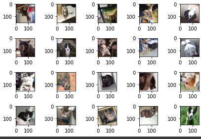
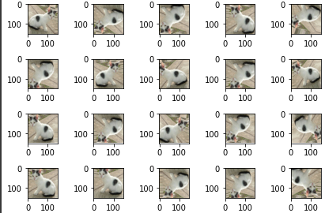

# 이미지 데이터 전처리

* Deep Learning은 데이터가 많아야 학습이 잘되고 accuracy도 높게 나옴

* 현실적으로 적은 양의 데이터로 학습 및 예측해야 되는 경우가 대부분임.

* 만약 데이터 정제가 잘 되어있더라도( 비교적 간단한 학습인 경우) 적은양의 데이터로도 학습이 가능

* 일반적으로 데이터량이 작다 라고 하는 경우는 10만개 이하

* deep learning은 픽셀수가 적은게 유리함 많으면 overfitting 발생할 수 있음.


## 방법1 - 사진 file을 읽기

* RGB pixel값으로 decoding (3차원 - 3channel이 아닌 1channel)

* 사이즈 동일하게 처리 및 정규화


## 방법2 - ImageDataGenerator

*  kears 안에 포함되어 있는 모듈
* I/O Latency 발생 가능성 (인풋, 아웃풋 지연)


## 방법3 - TF Record

* Tensorflow의 기본 자료구조

* 방법1과 방법2의 장점을 혼합한 형태

* 하지만 코드가 어려움.


# ImageDataGenerator

* 개와 고양이 데이터를 ImageDataGenerator을 이용해서 데이터셋하여 학습해보기.


## import

```python
import os
from tensorflow.keras.preprocessing.image import ImageDataGenerator
import matplotlib.pyplot as plt
```

* 경로 설정을 위해 os 모듈 import
* ImageDataGenerator를 사용하기 위한 import
* 이미지 확인하기 위해 plt import


## Data 불러오기 및 generator 설정

```python
train_dir = '/content/drive/MyDrive/Machine Learning Colab/CAT_DOG/cat_dog_small/train'
validation_dir = '/content/drive/MyDrive/Machine Learning Colab/CAT_DOG/cat_dog_small/validation'

train_datagen  = ImageDataGenerator(rescale=1/255)
validation_datagen = ImageDataGenerator(rescale=1/255)
```

* 미리 저장한 이미지 데이터 train과 validation 나눠서 불러와 변수에 담아주기
* 원본 영상은 0-255의 RGB 계수로 구성되는데, 이 같은 입력값은 모델을 효과적으로 학습시키기에 너무 높음. (통상적인 learning rate를 사용할 경우).  그래서 이를 1/255로 스케일링하여 0-1 범위로 변환.


## Generator

```python
train_generator = train_datagen.flow_from_directory(
    train_dir, # target directory
    classes=['cats', 'dogs'],    # cat=0, dog=1 # classes를 안 잡아주면 폴더 순서대로 label이 설정됨.
    target_size=(150,150), # 정사각형태가 고정은 아니지만 보통 정사각형으로 resize함. CNN구조에 따라 resize크기는 달라짐
    batch_size=20,         # 이미지 파일을 한번에 몇개씩 변형할지 폴더 상관없이 랜덤으로 가져옴
    class_mode='binary'    # 다중분류는 categorical (default 값) - (기본 one-hot처리)
                           # 'sparse'도 이용가능
)

validation_generator = validation_datagen.flow_from_directory(
    validation_dir, # target directory
    classes=['cats', 'dogs'],    # cat=0, dog=1 # classes를 안 잡아주면 폴더 순서대로 label이 설정됨.
    target_size=(150,150), # 정사각형태가 고정은 아니지만 보통 정사각형으로 resize함. CNN구조에 따라 resize크기는 달라짐
    batch_size=20,         # 이미지 파일을 한번에 몇개씩 변형할지 폴더 상관없이 랜덤으로 가져옴
    class_mode='binary'    # 다중분류는 categorical (default 값) - (기본 one-hot처리)
                           # 'sparse'도 이용가능
)
```


## Generator 특징 살펴보기

```python
# generator를 이용해보기
# generator는 data를 끊임없이 생성함. for문을 잘 못 돌리면 무한루프에 걸림.
for x_data, t_data in train_generator:
  print(x_data.shape) # (20, 150, 150, 3)
  print(t_data.shape) # (20,)
  break;

# 그림 이미지를 matplotlib을 이용해서 출력
fig = plt.figure()
fig_arr = list()

for i in range(20):
  fig_arr.append(fig.add_subplot(4,5,i+1))

for data_batch, label_batch in train_generator:
  for idx, img_data in enumerate(data_batch):
    fig_arr[idx].imshow(img_data)
  break;

fig.tight_layout()
plt.show()

# 다음 단계는 CNN을 구성하고 학습을 시키는 단계
# 이미지 크기가 크기 때문에 conv layer와 pooling layer를 늘려줘야 함.
```

```python
Found 2020 images belonging to 2 classes.
Found 1000 images belonging to 2 classes.
(20, 150, 150, 3)
(20,)
```




## CNN 구성하기

```python
import numpy as np
import tensorflow as tf
from tensorflow.keras.models import Sequential
from tensorflow.keras.layers import Conv2D, MaxPooling2D, Flatten, Dense, Dropout
from tensorflow.keras.optimizers import Adam

model = Sequential()
model.add(Conv2D(filters=32,
                 kernel_size=(3,3),
                 activation='relu',
                 input_shape=(150,150,3)))

model.add(MaxPooling2D(pool_size=(2,2)))

model.add(Conv2D(filters=64,
                 kernel_size=(3,3),
                 activation='relu'))

model.add(MaxPooling2D(pool_size=(2,2)))

model.add(Conv2D(filters=128,
                 kernel_size=(3,3),
                 activation='relu'))

model.add(MaxPooling2D(pool_size=(2,2)))

model.add(Conv2D(filters=128,
                 kernel_size=(3,3),
                 activation='relu'))

model.add(MaxPooling2D(pool_size=(2,2)))

model.add(Flatten())
model.add(Dense(units=512,
                activation='relu'))
model.add(Dropout(rate=0.5))
model.add(Dense(units=1,
                activation='sigmoid'))
print(model.summary())

model.compile(optimizer=Adam(learning_rate=1e-4),
              loss='binary_crossentropy',
              metrics=['accuracy'])

history = model.fit(train_generator,
                    steps_per_epoch=100, # 1epoch 돌 때 몇번 데이터를 가지고 올것인지
                    epochs=50,   # 전체 데이터를 몇번 epoch돌거냐
                    validation_data = validation_generator,
                    validation_steps=50
                    )
```


## 모델 저장하기

```python
# 학습이 종료된 후 모델을 저장할 수 있음.
model.save('/content/drive/MyDrive/Machine Learning Colab/CAT_DOG//cat_dog_small_cnn_tf2.h5')
```

* param들을 저장함으로써 불러왔을 때 다시 학습시켜야하는 번거로움을 방지할 수 있음


## history 객체로 상태보기

```python
# history 객체를 조사하면 과대적합이 발생했는지 등을 알 수 있음.
print(history.history)
print(history.history.keys())

train_acc = history.history['accuracy']
val_acc = history.history['val_accuracy']
train_loss = history.history['loss']
val_loss = history.history['val_loss']

plt.plot(train_acc, color='r', label='training accuracy') # label은 범례
plt.plot(val_acc, color='b', label='validation accuracy')
plt.legend()  #  범례 표시
# plt.show() # 15 epochs부터는 validation data가 acc이 증가하지 않음.

plt.plot(train_loss, color='r', label='training loss') # label은 범례
plt.plot(val_loss, color='b', label='validation loss')
plt.legend()  #  범례 표시
plt.show() # 15 epochs부터는 validation loss가 줄지 않고 늘어남 (학습의 의미가 없음.)
# 그래프를 보니 과대적합이 발생하는 것을 알 수 있음!
# 데이터가 적기 때문에 overfitting이 발생할 수 밖에 없는 환경임.
```


## Data Augmentation

* Overfitting 감소시키는 방법

```python
from tensorflow.keras.preprocessing import image
from tensorflow.keras.preprocessing.image import ImageDataGenerator
import matplotlib.pyplot as plt


datagen  = ImageDataGenerator(rotation_range=20, # 지정된 각도 범위내에서 임의로 원본 이미지를 회전
                              width_shift_range=0.1,
                              height_shift_range=0.1,
                              zoom_range=0.1, # 1-수치 혹은 1+수치 만큼 확대 및 축소
                              horizontal_flip=True,
                              vertical_flip=True) 
# 이미지 변형은 15도씩 회전하거나, 확대축소, 좌우반전, 상하반전, 이미지 포커스를 좌우로 이동하는 방식

img = image.load_img('/content/drive/MyDrive/Machine Learning Colab/CAT_DOG/cat_dog_small/train/cats/cat.3.jpg',
                     target_size=(150,150))
x = image.img_to_array(img)
print(x.shape) # (150, 150, 3)

x = x.reshape((1,) + x.shape)
print(x.shape) # (1, 150, 150, 3)

fig = plt.figure()
fig_arr = list()

for i in range(20):
  fig_arr.append(fig.add_subplot(4,5,i+1))

idx = 0

for batch in datagen.flow(x, batch_size=1): # 어떤 데이터를 증식할 것인지 명시
   fig_arr[idx].imshow(image.array_to_img(batch[0]))
   idx += 1
   if idx % 20 ==0:
     break

fig.tight_layout()
plt.show()
```

```python
(150, 150, 3)
(1, 150, 150, 3)
```




## Augmentation 적용하기

* 코드수정

```python
train_datagen  = ImageDataGenerator(rescale=1/255,
                                    rotation_range=20, # 지정된 각도 범위내에서 임의로 원본 이미지를 회전
                                    width_shift_range=0.1,
                                    height_shift_range=0.1,
                                    zoom_range=0.1, # 1-수치 혹은 1+수치 만큼 확대 및 축소
                                    horizontal_flip=True,
                                    vertical_flip=True)

validation_datagen = ImageDataGenerator(rescale=1/255) # 평가데이터는 증식을 하지 않음.
```

- `rotation_range`: 이미지 회전 범위 (degrees)
- `width_shift`, `height_shift`: 그림을 수평 또는 수직으로 랜덤하게 평행 이동시키는 범위 (원본 가로, 세로 길이에 대한 비율 값)
- `zoom_range`: 임의 확대/축소 범위
- `horizontal_flip`, `vertical_flip`: True로 설정할 경우, 50% 확률로 이미지를 수평, 수직으로 뒤집음.  원본 이미지에  수평, 수직의 비대칭성이 없을 때 효과적임.  즉, 뒤집어도 자연스러울 때 사용하면 좋음.


## 데이터 증식을 한 전체코드

```python
# 증식을 이용한 코드

import os
from tensorflow.keras.preprocessing.image import ImageDataGenerator
import matplotlib.pyplot as plt

train_dir = '/content/drive/MyDrive/Machine Learning Colab/CAT_DOG/cat_dog_small/train'
validation_dir = '/content/drive/MyDrive/Machine Learning Colab/CAT_DOG/cat_dog_small/validation'

# ImageDataGenerator 생성
# train과 validation 을 각각 생성해야 함.
# 정규화(MinMaxScaling 이용)
train_datagen  = ImageDataGenerator(rescale=1/255,
                                    rotation_range=20, # 지정된 각도 범위내에서 임의로 원본 이미지를 회전
                                    width_shift_range=0.1,
                                    height_shift_range=0.1,
                                    zoom_range=0.1, # 1-수치 혹은 1+수치 만큼 확대 및 축소
                                    horizontal_flip=True,
                                    vertical_flip=True)

validation_datagen = ImageDataGenerator(rescale=1/255) # 평가데이터는 증식을 하지 않음.

train_generator = train_datagen.flow_from_directory(
    train_dir, # target directory
    classes=['cats', 'dogs'],    # cat=0, dog=1 # classes를 안 잡아주면 폴더 순서대로 label이 설정됨.
    target_size=(150,150), # 정사각형태가 고정은 아니지만 보통 정사각형으로 resize함. CNN구조에 따라 resize크기는 달라짐
    batch_size=20,         # 이미지 파일을 한번에 몇개씩 변형할지 폴더 상관없이 랜덤으로 가져옴
    class_mode='binary'    # 다중분류는 categorical (default 값) - (기본 one-hot처리)
                           # 'sparse'도 이용가능
)

validation_generator = validation_datagen.flow_from_directory(
    validation_dir, # target directory
    classes=['cats', 'dogs'],    # cat=0, dog=1 # classes를 안 잡아주면 폴더 순서대로 label이 설정됨.
    target_size=(150,150), # 정사각형태가 고정은 아니지만 보통 정사각형으로 resize함. CNN구조에 따라 resize크기는 달라짐
    batch_size=20,         # 이미지 파일을 한번에 몇개씩 변형할지 폴더 상관없이 랜덤으로 가져옴
    class_mode='binary'    # 다중분류는 categorical (default 값) - (기본 one-hot처리)
                           # 'sparse'도 이용가능
)

# generator를 이용해보기
# generator는 data를 끊임없이 생성함. for문을 잘 못 돌리면 무한루프에 걸림.
for x_data, t_data in train_generator:
  print(x_data.shape) # (20, 150, 150, 3)
  print(t_data.shape) # (20,)
  break;

# 그림 이미지를 matplotlib을 이용해서 출력
fig = plt.figure()
fig_arr = list()

for i in range(20):
  fig_arr.append(fig.add_subplot(4,5,i+1))

for data_batch, label_batch in train_generator:
  for idx, img_data in enumerate(data_batch):
    fig_arr[idx].imshow(img_data)
  break;

fig.tight_layout()
plt.show()

# 다음 단계는 CNN을 구성하고 학습을 시키는 단계
# 이미지 크기가 크기 때문에 conv layer와 pooling layer를 늘려줘야 함.
```


# 이후 과제

**데이터 전체를 대상으로 방법1과 방법2+ augmentation를 사용한 모델의 정확도 비교해보기!**

