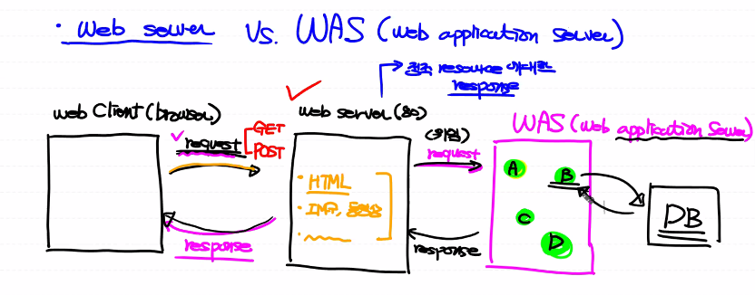
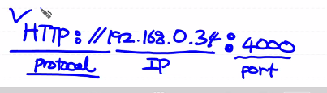
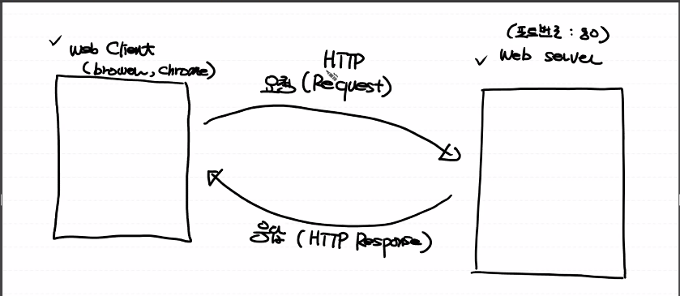
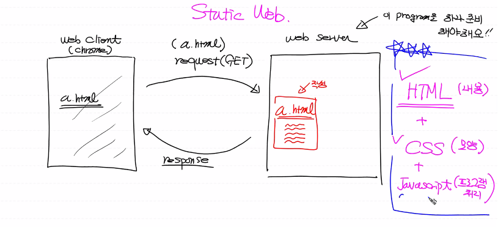

# Web programming

>  HTTP protocol로 통신하는 클라이언트 프로그램과 서버 프로그램을 개발
>
> 각각 개발할 수도 있고 함께 개발할 수도 있음.


## 개념


### Protocol 

```html
Data 통신을 위해 지켜야할 약속, 규약

ex) HTTP://(web 전용), FTP(file전송 전용), SMTP(E-mail)
```


### Port

```html
0 ~ 65535 범위 안에 있는 하나의 숫자 (포트번호)
하나의 Process (프로그램) 을 지칭하는 숫자 (메모장, zoom, chrome, 탐색기, ....)

0    ~ 1024  : reserved (약속으로 이미 지정)

1025 ~ 65535 : 사용자가 이용할 수 있는 번호
```


### Client & Server

```html
web program : CS(client, Server)구조로 되어있음

client      : 능동적으로 서비스를 요청

server      : 클라이언트 요청에 대해 service 제공.
```


### Web client 

```html
web server에 접속하는 클라이언트 프로그램

ex) Browser(chrome, IE, safari)

우리가 얼마든지 작성이 가능!
```


### Web server 

```html
web client의 요청을 받아 서비스를 제공하는 프로그램.


client에게 빠른 서비스 제공을 위해 server의 퍼포먼스가 중요하기 때문에 기존에 잘 만들어진 server를 주로 이용.
* Apache web server

디폴트로 포트번호 80번을 가지고 있음.
```


**잠깐! WAS(web application server)와 web server 구분하기**



```html
web server는 정적 resource에 대한 response만 줄 수 있음.

프로그램 호출하는 일은 WAS에게 request를 전달.

Was는 처리된 결과를 다시 web server에게 전달.
```


### Address

> 프로토콜 동작으로 IP주소를 MAC 주소로 변경해주어 특정 컴퓨터로 찾아갈 수 있음. 

**IP주소(address)**

* Nework에 연결되어 있는 각종 기기에 부여되는 논리적인 주소. 
* 가변적임.
* 총 4자리, 단편적으로 컴퓨터를 지칭.


**MAC address**

* Network에 연결되어 있는 각종 기기에 부여되는 물리적인 주소. 
* 불변적
* 총 6자리

---


### URL(Uniform Resource Locater)



---


### Web 동작 방식



---


### HTTP Protocol 

> Hypertext transfer protocol의 약자
>
> Stateless protocol로 불리기도 함.


* 웹서버와 웹 클라이언트가 서로 데이터를 주고 받기 위해 사용하는 통신규약

* TCP/IP Protocol stack위에서 동작하는 protocol

* IP address를 기반으로 통신


**http**

 Text뿐만 아니라 이미지, 동영상, PDF 등 여러 종류의 Data를 주고받을 수 있음.


**HTTP Protocol 중요 특성** 

* request를 보낼 때 연결이 성립되며, server에서도 연결된 통로를 이용해 리스폰을 보냄.

* 다수의 client의 요청을 받기 위해 완료되면 연결이 끊어짐.


**HTTP Protocol 단점**

* 서버가 클라이언트를 구별할 수 없어서 `stateless protocol`이라고 부르기도 함.
* 서버가 클라이언트의 상태를 알 수가 없음

---


### HTTP Request message 형태


#### 과정

```html
메소드(요청방식) -> 리소스->  HTTP버전

Host

body
```


#### 요청방식 4가지 (기억필요)

##### get 

```html
기존 데이터를 서버쪽에서 불러올 때

내가 전달할 데이터를 Query String 형식으로 URL뒤에 붙여서 보냄


장점 : 사용하기 쉽다.

단점 : 보안성 x, URL 길이제한이 있음.
```


##### post 

```html
새로운 데이터를 서버쪽에 생성하고 싶을 때

전달할 데이터를 Request message body안에 포함해서 전송


장점 : 보안성이 있고, 전송할 데이터의 길이제한이 없음.
```


#####  put, delete

```html
put    : 서버쪽에 있는 데이터를 수정할 때

delete : 서버쪽에 있는 데이터를 삭제할 때
```


**Get, Post 두가지 방식으로도 모든 CRUD 작업이 가능. 우리는 이 두가지 방식을 주로 사용할거다!!!**

---


## python 프로그램으로 server에 Request 보내기

**Python_ML에 python file저장**

```python
import urllib.request

url_obj = urllib.request.urlopen('http://www.example.com:80')
# '192.168.33.4' => www.example.com
#     IP Address => Domain Name
print(url_obj) # Response의 내용을 가지고 있는 객체

print(url_obj.read().decode('utf-8'))
```


**Anaconda prompt** 

```python
C:\python_ML> 로 이동

python webclient_test.py 입력
```


## HTML

> Web에서 사용하는 마크업 언어.
>
> 데이터를 어떻게 표현할 것인지에 집중
>
> `<>` 를 이용해 표현

```html
web storm 툴을 이용해야함.

web server안에 프로젝트단위로 관리를 하게 됨.


작업과정
1. 프로젝트 만들기
2. 프로젝트 안에 파일 만들기
3. web server program 실행 (webstorm안에 내장 web server가 있음)
4. web server가 우리 project를 인식(configure)해야 나중에 client가 요청을 했을 때 서비스를 할 수 있음
5. 인식한 우리 project를 web에서 사용할 수 있도록 전개(deploy)
6.  web client(brower) 실행, URL 입력
7. html 자료를 받아 rendering
```


---

**우리가 공부해야할 것들**



**우리가 알야할 것들**

**Web client application** : HTTML, CSS< JAvascript

**Web server application** : Django(python), servlet(java)


---


