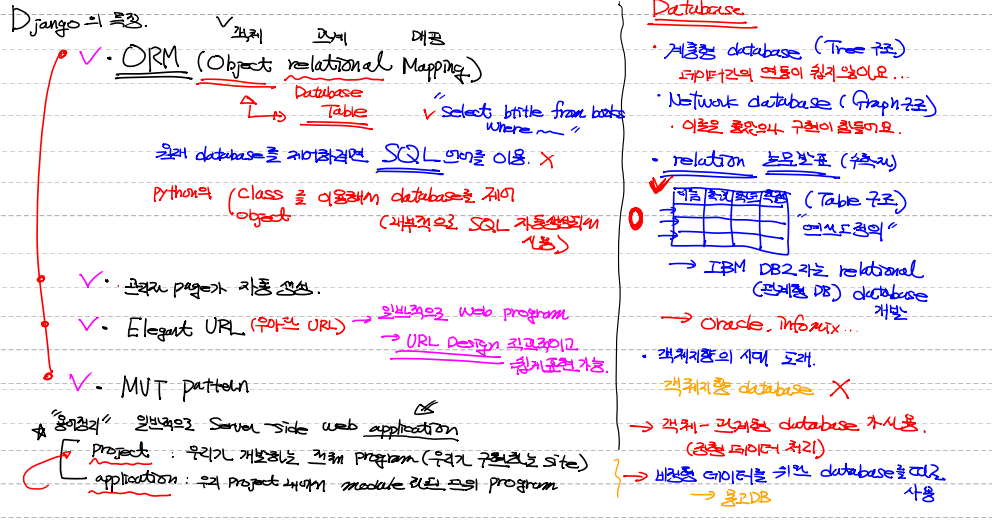
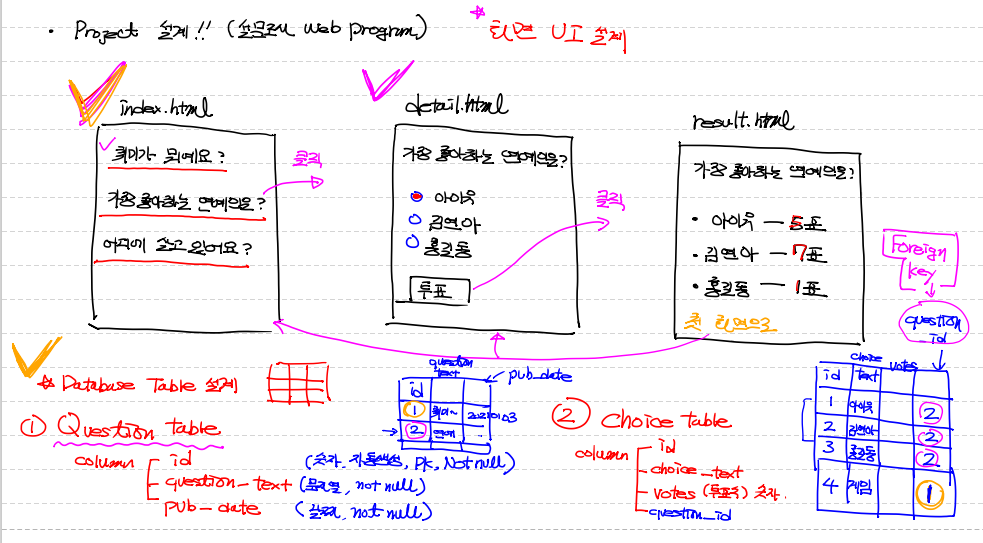
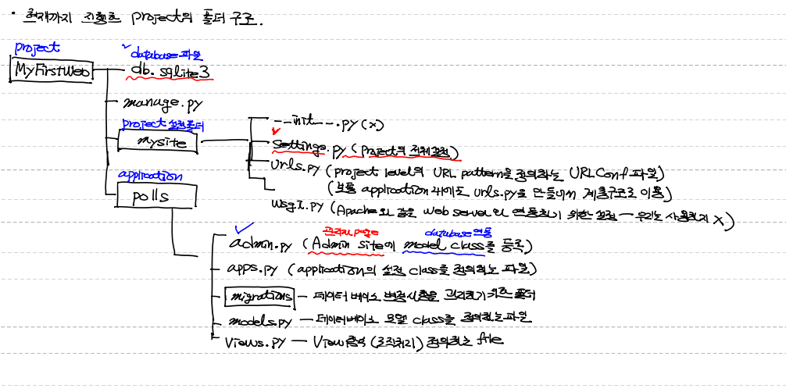

# dJango


## 개요

1. **web server** 

   인터넷을 통해 client의 request가 전달됐을 때 이 요청을 처리하는 Hardware, software/ 정적 resource를 서비스.

   

2. **CGI(Common Gateway Interface)** 

   web server에서 application을 수행시키기 위한 규약. 

   정적인 web sever에 동적인 program을 수행시킬 수 있는 기능을 부여.

    클라이언트 request -> 웹서버(Apache, NGinX) -> 프로그램을 실행(web server가 직접)

   

3. **WAS(web application server)**  

   일반적으로 web server와 web application을 동작 시킬 수 있는 Container(engine) / Tomcat, Jboss

   

4. **WSGI(web server Gateway InterFace)** 

   python에 종속된 개념. python으로 python script(web application)가 web server와 통신하기 위한 규약. 

   middle(거의 was역할).


## 개념

> python으로 만들어진 무료로 사용할 수 있는 web application Framework


## 특징

1. **MVC기반을 하는 MVT(Model View Template) 패턴을 이용**. 

   특이점이 view가 화면처리를 하지 않고 logic처리를 함.

   template이 UI처리를 해줌.

   ---

   *잠깐*

   *MVC?*

   *Model, View, Controller*

   *model에서 data를 처리하고 controller에서 business logic을 처리하여 respone을 보내주는데 html파일을 그래픽처리를 view에서 처리해줌.*

   ---

2. **ORM(Object Relational Mapping : 객체 관계 맵핑)**

   일반적으로 사용하는 건 관계형 데이터베이스

   ORM은 database를 사용할 때 SQL언어를 이용 안하고 python의 class object를 이용해서 database를 제어(내부적으로 SQL 자동생산되어 시행)

   

   ---

   *잠깐!...*

   *데이터베이스 Story...*

   * *처음에는 계층형 데이터베이스를 사용함 왜냐하면 사람이 생각하는 것과 일치하기 때문. 그런데 데이터간의 연동이 쉽지 않음.*

   * *이후 network 데이터베이스 그래프 구조가 나왔으나 구현이 힘들어서* 

   * *relation 구조 (table 구조)를 가지는 관계형 데이터베이스 개발*

   * *객체지향 데이터베이스가 나왔지만 별로라 객체 -관계형 데이터베이스가 사용됨.(정형 데이터 처리)*

   ---

   3. **관리자 page가 자동으로 생성됨.**
   4. **Elegant URL을 사용함.** (URL표현이 나이스하다..? 일반적으로 웹프로그램할 때 URL 디자인이얌.. URL 형태를 우리가 지정해줌. 좀 더 직관적이고 쉽게 표현이 가능하다 이말이야)

   

   

   

   

## 용어정리

```django
project

우리가 개발하는 전체 program(우리가 구현하는 site)


application

우리 project 내에서 module화 된 단위 program들
```


## 화면  UI 설계



### 1. Project 만들기



* Django 설치

* C드라이브로 이동
* 폴더 생성

```
mkdir python-Django
```

* 생성폴더로 진입 후 프로젝트 만들기

```
(base) C:\>cd python-Django

(base) C:\python-Django>django-admin startproject mysite
```

* 중복되는 폴더명 변경 후 폴더로 진입

```
(base) C:\python-Django>cd MyFirstWeb
```

* manage.py를 이용해서 프로젝트 추가

```
python manage.py startapp polls
```

* 파이참 설정하기

```python
ALLOWED_HOSTS = ['Localhost', '127.0.0.1']
```


* setting.py에서  INSTALLED_APPS 에 설치된 application 명시

```python
'polls.apps.PollsConfig'
```


* Time zone 변경

```python
TIME_ZONE = 'Asia/Seoul'
```


terminal 확인사항

* 데이터베이스 파일(db.sqlite3) 만들기

```python
python manage.py migrate
```


* middleware 작동확인

```python
python manage.py runserver
```


